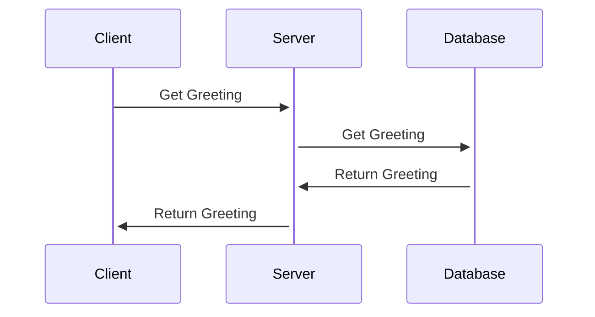
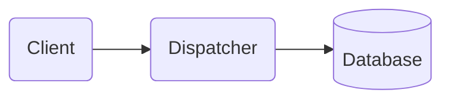

# Release 0.0.1-alpha

The first release is aimed to make a simple integration between frontend and database via server-side dispatcher.
The integration has a form of database stored predefined message "Welcome to Genemis" which is displayed on the simple UI.

Interaction

The release includes the following components and features:
- Frontend:
    - Standard layout with main shell components Header and Footer;
    - Custom Font is applied throughout the app;
    - Color palette is applied to the components
    - Simple routing is added for the start page
    - Unit tests are optional

- Backend:
    - Simple dispatcher in Java based on Spring Boot
    - REST API based on WebFlux
    - Integration with MongoDB as the storage for the message
    - Simple Unit/Integration tests

- Database:
    - MongoDB container running in Docker
    - DB is initialized with a collection, which contains a message for the UI

Components

