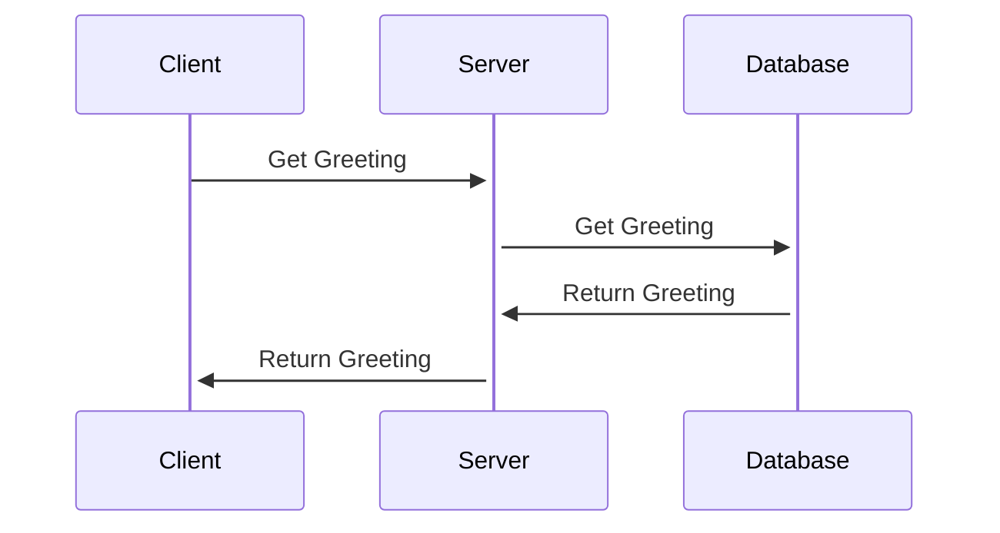
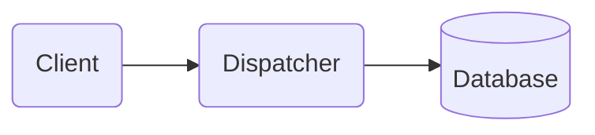

# Release 0.0.1-alpha

The first release is aimed to make a simple integration between frontend and database via server-side dispatcher.
The integration has a form of database stored predefined greeting "Welcome to Genemis" which is displayed on the simple UI.

